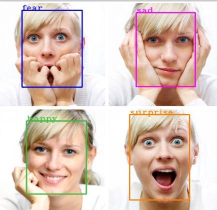

# Reconnaissance Faciale et Détection des Émotions

----------
 
----------

### Détection des émotions

La communication non verbale joue un rôle fondamental dans les interactions humaines. Les émotions permettent d’exprimer clairement les pensées et les intentions. Pouvoir détecter ces émotions à l’aide d’un ordinateur ouvre des perspectives intéressantes. Ce projet vise à développer un modèle capable de reconnaître les émotions humaines à partir d’images faciales. Les étapes clés sont les suivantes :

1. Collecte et augmentation des données
Le jeu de données utilisé est fer2013, disponible sur GitHub : fer2013. Des techniques d’augmentation d’images ont été appliquées pour enrichir l’ensemble de données.

2. Construction du modèle
L’architecture repose sur un réseau de neurones convolutifs (CNN), intégrant les couches suivantes : Convolution, Max Pooling, Flatten, Dropout

3. Entraînement du modèle
Le modèle a été entraîné en testant différentes variantes de couches et en ajustant les hyperparamètres. Le meilleur modèle a atteint 60.1 % de précision en validation.

4. Évaluation et test
Le modèle a été testé sur plusieurs images, avec des résultats visuellement satisfaisants :

  

#### The model will be able to detect 7 types of emotions:-
 #####  Angry , Sad ,  Neutral ,  Disgust ,  Surprise ,  Fear  , and   Happy

## Usage:

### For  Face Detection, and Emotion Detection Code

Refer to the notebook /Emotion_Detection.ipynb. 
I have trained an emotion detection model and put its trained weights at /Models

### Train your Emotion Detection Model
To train your own emotion detection model, Refer to the notebook /facial_emotion_recognition.ipynb

### For Emotion Detection  using Webcam 
#### Clone the repo:
Run `pip install -r requirements.txt`  
` python Emotion_Detection.py`

